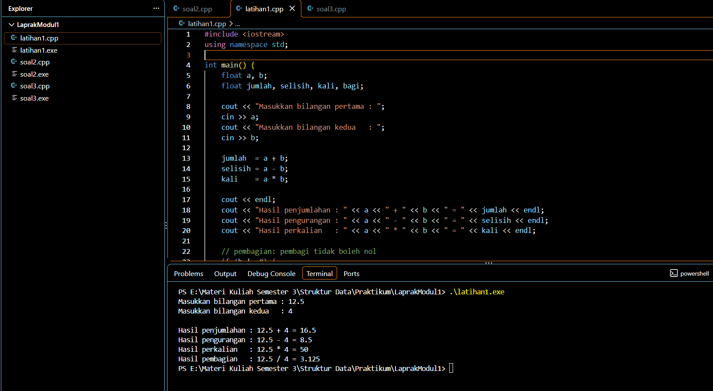
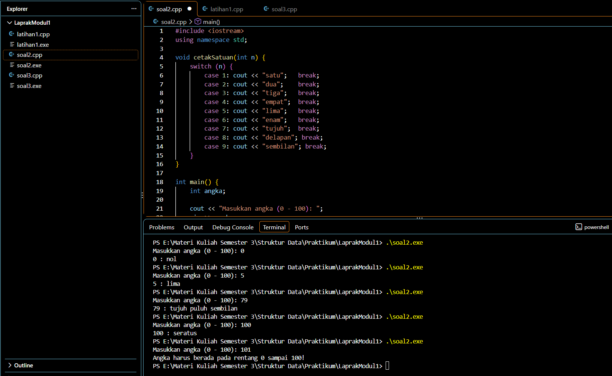
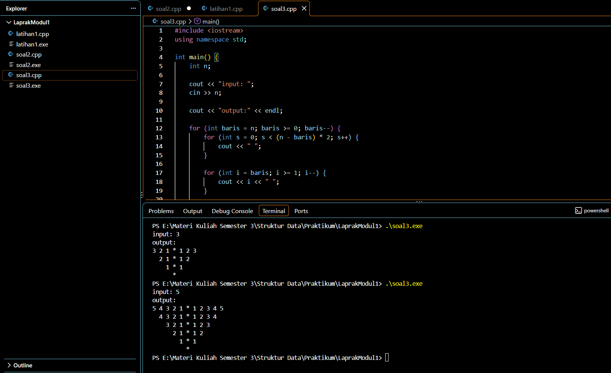

# Laporan Praktikum Modul 1 - Code Blocks IDE & Pengenalan Bahasa C++ (Bagian Pertama)

## Biodata

| | |
|---|---|
| **Nama** | [RAKHMAT_PRATAMA] |
| **NIM** | [109082530037] |
| **Kelas** | [S1IF-13-01] |
| **Mata Kuliah** | Struktur Data |
| **Program Studi** | S1 Informatika, Fakultas Informatika, Telkom University |

---

## Unguided

### 1. Buatlah program yang menerima input-an dua buah bilangan bertipe float, kemudian memberikan output-an hasil penjumlahan, pengurangan, perkalian, dan pembagian dari dua bilangan tersebut.

#### soal1.cpp

```cpp
#include <iostream>
using namespace std;

int main() {
    float a, b;
    float jumlah, selisih, kali, bagi;

    cout << "Masukkan bilangan pertama : ";
    cin >> a;
    cout << "Masukkan bilangan kedua   : ";
    cin >> b;

    jumlah  = a + b;
    selisih = a - b;
    kali    = a * b;

    cout << endl;
    cout << "Hasil penjumlahan : " << a << " + " << b << " = " << jumlah << endl;
    cout << "Hasil pengurangan : " << a << " - " << b << " = " << selisih << endl;
    cout << "Hasil perkalian   : " << a << " * " << b << " = " << kali << endl;

    if (b != 0) {
        bagi = a / b;
        cout << "Hasil pembagian   : " << a << " / " << b << " = " << bagi << endl;
    } else {
        cout << "Hasil pembagian   : tidak dapat dilakukan (pembagi bernilai 0)" << endl;
    }

    return 0;
}
```

### Output Unguided :

##### Output



Contoh hasil eksekusi (input 12.5 dan 4):

```
Masukkan bilangan pertama : 12.5
Masukkan bilangan kedua   : 4

Hasil penjumlahan : 12.5 + 4 = 16.5
Hasil pengurangan : 12.5 - 4 = 8.5
Hasil perkalian   : 12.5 * 4 = 50
Hasil pembagian   : 12.5 / 4 = 3.125
```

#### Penjelasan

Program ini menerima dua bilangan yang disimpan pada variabel `a` dan `b` bertipe `float`. Tipe `float` dipilih karena soal meminta bilangan pecahan, sehingga bilangan desimal seperti 12.5 dapat disimpan dan hasil pembagian tidak dibulatkan menjadi bilangan bulat.

Alur program:

1. `#include <iostream>` dan `using namespace std;` dipakai agar fungsi input/output `cin` dan `cout` dapat digunakan.
2. Variabel `a`, `b` (masukan) dan `jumlah`, `selisih`, `kali`, `bagi` (hasil) dideklarasikan dengan tipe `float`.
3. `cout` menampilkan pesan permintaan input, lalu `cin >> a;` dan `cin >> b;` membaca nilai yang diketik pengguna ke dalam variabel.
4. Operator aritmatika `+`, `-`, dan `*` digunakan untuk menghitung penjumlahan, pengurangan, dan perkalian, lalu hasilnya ditampilkan dengan `cout`.
5. Sebelum pembagian, program memeriksa kondisi `if (b != 0)`. Pembagian bilangan dengan nol tidak terdefinisi, sehingga jika pembagi bernilai 0 program menampilkan pesan bahwa pembagian tidak dapat dilakukan. Jika tidak, hasil `a / b` ditampilkan.
6. `return 0;` menandakan program selesai dengan normal.

---

### 2. Buatlah sebuah program yang menerima masukan angka dan mengeluarkan output nilai angka tersebut dalam bentuk tulisan. Angka yang akan di-input-kan user adalah bilangan bulat positif mulai dari 0 s.d 100.

#### soal2.cpp

```cpp
#include <iostream>
using namespace std;

void cetakSatuan(int n) {
    switch (n) {
        case 1: cout << "satu";   break;
        case 2: cout << "dua";    break;
        case 3: cout << "tiga";   break;
        case 4: cout << "empat";  break;
        case 5: cout << "lima";   break;
        case 6: cout << "enam";   break;
        case 7: cout << "tujuh";  break;
        case 8: cout << "delapan"; break;
        case 9: cout << "sembilan"; break;
    }
}

int main() {
    int angka;

    cout << "Masukkan angka (0 - 100): ";
    cin >> angka;

    if (angka < 0 || angka > 100) {
        cout << "Angka harus berada pada rentang 0 sampai 100!" << endl;
        return 0;
    }

    cout << angka << " : ";

    if (angka == 0) {
        cout << "nol";
    } else if (angka == 100) {
        cout << "seratus";
    } else if (angka < 10) {
        cetakSatuan(angka);
    } else if (angka == 10) {
        cout << "sepuluh";
    } else if (angka == 11) {
        cout << "sebelas";
    } else if (angka < 20) {
        cetakSatuan(angka % 10);
        cout << " belas";
    } else {
        cetakSatuan(angka / 10);
        cout << " puluh";
        if (angka % 10 != 0) {
            cout << " ";
            cetakSatuan(angka % 10);
        }
    }

    cout << endl;
    return 0;
}
```

### Output Unguided :

##### Output



Contoh hasil eksekusi untuk beberapa masukan:

| Input | Output |
|---|---|
| 0 | `0 : nol` |
| 5 | `5 : lima` |
| 10 | `10 : sepuluh` |
| 11 | `11 : sebelas` |
| 15 | `15 : lima belas` |
| 20 | `20 : dua puluh` |
| 79 | `79 : tujuh puluh sembilan` |
| 100 | `100 : seratus` |
| 101 | `Angka harus berada pada rentang 0 sampai 100!` |

#### Penjelasan

Program ini mengubah angka bulat 0 sampai 100 menjadi tulisan dalam bahasa Indonesia. Karena aturan penulisan angka Indonesia berbeda-beda untuk tiap kelompok, program memakai percabangan `if - else if - else` dan satu fungsi bantu.

1. **Fungsi `cetakSatuan(int n)`** memakai pernyataan `switch` untuk mencetak tulisan angka 1 sampai 9 (satu, dua, ..., sembilan). Setiap `case` diakhiri `break` agar eksekusi tidak jatuh ke `case` berikutnya. Fungsi ini dipakai berulang kali sehingga kode tidak perlu ditulis ulang.
2. **Validasi input:** jika angka kurang dari 0 atau lebih dari 100 (`angka < 0 || angka > 100`), program menampilkan pesan kesalahan dan berhenti. Operator `||` adalah operator logika OR.
3. **Pembagian kasus:**
   - `angka == 0` dicetak `nol`.
   - `angka == 100` dicetak `seratus`.
   - `angka < 10` (1 sampai 9) langsung memanggil `cetakSatuan(angka)`.
   - `angka == 10` dan `angka == 11` adalah kasus khusus: `sepuluh` dan `sebelas`.
   - `12 sampai 19` dicetak satuannya lalu diikuti kata `belas`. Satuan diambil dengan operator sisa bagi `angka % 10` (contoh: 15 % 10 = 5, sehingga `lima belas`).
   - `20 sampai 99`: angka puluhan diambil dengan pembagian bulat `angka / 10` (contoh: 79 / 10 = 7) dan diikuti kata `puluh`. Jika satuannya tidak nol (`angka % 10 != 0`), satuan dicetak setelahnya. Contoh: 79 menjadi `tujuh puluh sembilan`, sedangkan 90 hanya `sembilan puluh`.

Karena `angka` bertipe `int`, operasi `/` menghasilkan pembagian bilangan bulat (bagian desimal dibuang), sehingga cocok untuk mengambil digit puluhan.

---

### 3. Buatlah program yang dapat memberikan input dan output sebagai berikut (Mirror).

```
input: 3
output:
3 2 1 * 1 2 3
  2 1 * 1 2
    1 * 1
      *
```

#### soal3.cpp

```cpp
#include <iostream>
using namespace std;

int main() {
    int n;

    cout << "input: ";
    cin >> n;

    cout << "output:" << endl;

    for (int baris = n; baris >= 0; baris--) {
        for (int s = 0; s < (n - baris) * 2; s++) {
            cout << " ";
        }

        for (int i = baris; i >= 1; i--) {
            cout << i << " ";
        }

        cout << "*";

        for (int i = 1; i <= baris; i++) {
            cout << " " << i;
        }

        cout << endl;
    }

    return 0;
}
```

### Output Unguided :

##### Output



Contoh hasil eksekusi (input 3):

```
input: 3
output:
3 2 1 * 1 2 3
  2 1 * 1 2
    1 * 1
      *
```

#### Penjelasan

Program ini mencetak pola cermin (mirror) dari angka `n` yang dimasukkan pengguna. Pola terdiri dari `n + 1` baris. Baris pertama memuat angka `n` sampai 1 di kiri, tanda `*` di tengah, dan angka 1 sampai `n` di kanan. Setiap baris berikutnya berisi satu angka lebih sedikit di tiap sisi, sampai baris terakhir hanya berisi `*`.

Program memakai perulangan `for` bersarang. Perulangan luar dengan variabel `baris` berjalan dari `n` turun ke 0 dan menentukan banyaknya angka pada tiap sisi baris tersebut. Di dalamnya ada empat bagian:

1. **Perulangan spasi:** mencetak `(n - baris) * 2` spasi. Pada baris pertama (`baris = n`) tidak ada spasi, lalu bertambah 2 spasi tiap baris karena setiap angka dan spasi pemisahnya menempati 2 kolom. Ini yang membuat pola tampak rata tengah.
2. **Sisi kiri:** perulangan `i` dari `baris` turun ke 1, mencetak `i` diikuti satu spasi (contoh untuk `baris = 3`: `3 2 1 `).
3. **Tanda `*`:** dicetak sekali sebagai pemisah tengah.
4. **Sisi kanan:** perulangan `i` dari 1 naik ke `baris`, mencetak satu spasi diikuti `i` (contoh: ` 1 2 3`).

Setelah itu `endl` memindahkan cetakan ke baris baru. Pada `baris = 0`, kedua perulangan sisi tidak berjalan sehingga hanya `*` yang tercetak, sesuai baris terakhir pada contoh.

Catatan: penyejajaran hanya rapi untuk `n` satu digit (1 sampai 9), karena angka dua digit menempati lebih dari satu kolom.

---

## Kesimpulan

Dari praktikum Modul 1 ini dapat disimpulkan bahwa:

1. Program C++ sederhana tersusun dari `#include <iostream>`, `using namespace std;`, dan fungsi utama `main()`. Setiap pernyataan diakhiri titik koma (`;`), dan variabel harus dideklarasikan lebih dahulu sebelum dipakai.
2. Operasi input dan output dilakukan dengan `cin >>` dan `cout <<`. Tipe data yang dipilih harus sesuai kebutuhan. Pada soal 1, tipe `float` dipakai agar bilangan pecahan dan hasil pembagian tersimpan dengan benar.
3. Operator aritmatika (`+`, `-`, `*`, `/`, `%`), operator relasi (`!=`, `==`, `<`, `>`), dan operator logika (`||`) digunakan untuk menghitung dan mengambil keputusan. Operator `/` dan `%` pada bilangan bulat berguna untuk memisahkan digit puluhan dan satuan pada soal 2.
4. Struktur kondisional `if - else if - else` dan `switch` dipakai untuk memilih aksi berdasarkan nilai masukan, termasuk validasi seperti mencegah pembagian dengan nol dan membatasi rentang angka.
5. Perulangan `for` (termasuk yang bersarang) memudahkan pencetakan pola yang berulang seperti pada soal 3, sehingga kode lebih ringkas dibanding menulis tiap baris secara manual. Fungsi juga membantu menghindari penulisan kode yang berulang, seperti `cetakSatuan()` pada soal 2.

---

## Daftar Pustaka

1. Laboratorium Informatika, Fakultas Informatika, Telkom University. *Modul 1: Code Blocks IDE & Pengenalan Bahasa C++ (Bagian Pertama)*. Modul Praktikum Struktur Data.
2. Stroustrup, B. (2013). *The C++ Programming Language* (4th ed.). Addison-Wesley.
3. cppreference.com. *C++ reference: Operators, Statements (if, switch, for), and Input/output library*. https://en.cppreference.com
4. cplusplus.com. *C++ Language Tutorial*. https://cplusplus.com/doc/tutorial/
